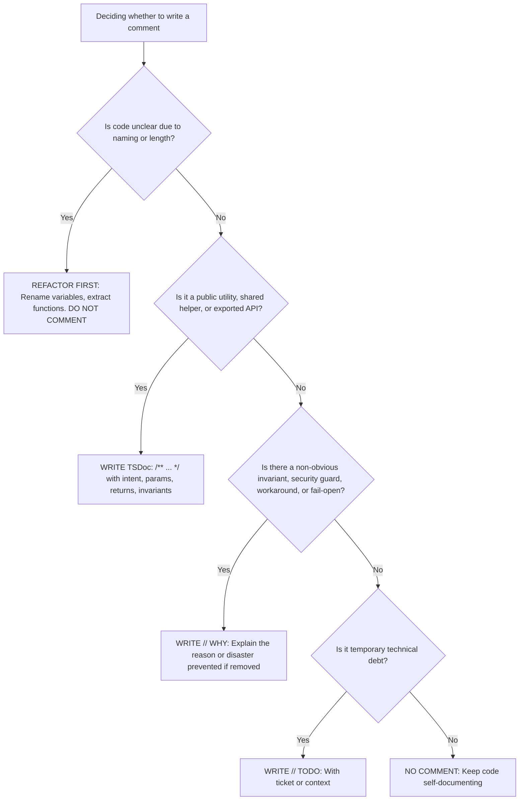

# Code Comment Taxonomy & Standards

## Core Philosophy

> **"Code tells you HOW, Comments tell you WHY."**  
> Self-documenting code with expressive naming is always preferred over explanatory comments.

---

## The 4-Tier Comment Taxonomy



---

### Tier 1: TSDoc / JSDoc (`/** ... */`) — Public & Shared APIs

**Scope**: Exported utilities (`utils/`), shared test helpers (`test/helpers/`, `test/factories/`, `test/mothers/`), custom decorators, pipes, guards, and complex domain service methods.

```ts
/**
 * Short one-line summary of intent.
 *
 * @param param1 Description
 * @returns Description
 * @invariant INV-N Domain invariant reference
 */
```

---

### Tier 2: `// WHY:` Comments — Technical Rationale & Invariants

**Scope**: Non-obvious architectural decisions, security safeguards, concurrency handling, resilience strategies, and third-party library workarounds.  
**Format**: MUST start with `// WHY: <Concrete technical reason>`.

```ts
// WHY: Fail-open strategy if Redis rate-limiter is offline, prioritizing API availability.
return true;
```

---

### Tier 3: `// TODO:` Comments — Tracked Technical Debt

**Rule**: NEVER write bare `// TODO: fix this`. Every TODO must name the context, issue, or condition: `// TODO(ticket-id): context`.

---

### Tier 4: Banned Comments (Strictly Prohibited)

- **Echoing Code**: Stating what code already expresses (`// get user by id`).
- **Excusing Poor Code**: Writing comments instead of clean variable/function names.
- **Dead Code**: Commented-out lines (Git tracks history).
- **Changelog / Author Tags**: Use `git blame` and `git log`.
- **Non-English Comments**: All comments in source files MUST be in English.
