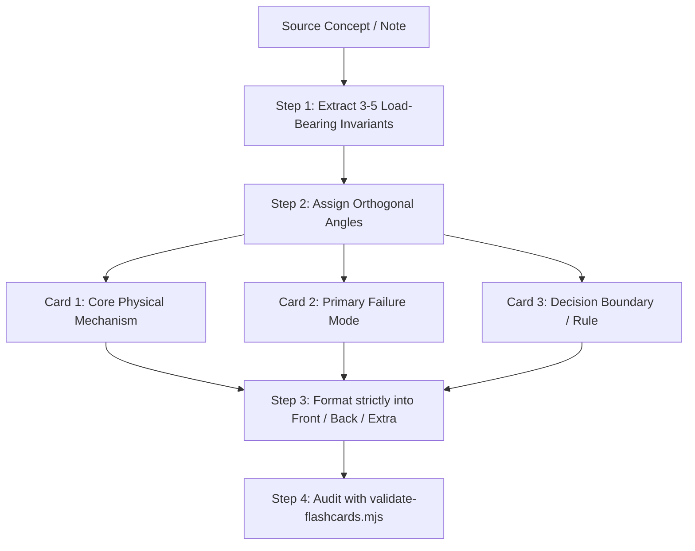

# Writing Flashcards

Design and forge high-signal, atomic flashcards optimized for **Spaced Repetition Systems (Anki, Yanki, SuperMemo)**.

A great flashcard is NOT a mini-article or lecture summary. It is an **Atomic Retrieval Unit** designed to trigger a rapid, binary memory check (Retrieved or Failed) within $3$ to $8$ seconds.

## Cognitive Foundations

Flashcard engineering rests on four foundational cognitive principles:

1. **Active Recall over Recognition (Testing Effect):**
   - Testing is not an assessment tool; it is an active encoding event. Forcing the brain to retrieve information strengthens neural synaptic pathways far more than re-reading notes.
2. **Minimum Information Principle (Piotr Wozniak, SuperMemo):**
   - _Items must be as simple as possible._ Simplicity accelerates review speed, reduces cognitive fatigue, prevents partial-forgetting ambiguity, and stabilizes interval scheduling.
3. **Atomic Lattice Structure (Andy Matuschak):**
   - Naive atomicity creates isolated trivia. Sound knowledge engineering decomposes a complex conceptual system into a **densely interconnected lattice of atomic prompts** attacking the concept from orthogonal angles (Definition, Cause, Failure mode, Boundary condition, Decision rule).
4. **Desirable Difficulty & Ebbinghaus Flattening:**
   - Review must occur when the memory trace is on the verge of fading. Straining to retrieve information flattens the forgetting curve.

---

## The 5 Laws of Flashcard Engineering

### Law 1: One Retrieval Target per Card (Strict Atomicity)

- Each card tests exactly **one mechanism, one fact, or one decision rule**.
- **The "And" Smell:** If a question contains "và", "đồng thời", or asks for both the cause AND the solution, split it into two independent cards. Asymmetric recall (remembering part A while forgetting part B) destabilizes spaced repetition algorithms.

### Law 2: 3-Second Binary Evaluability

- When flipping the card, the user must know with $100\%$ certainty within 2 seconds whether they scored **Pass (1)** or **Fail (0)**.
- If the back contains 4 paragraphs, the learner will rationalize partial recollection, leading to **Review Churn** and illusion of competence.

### Law 3: Strict Front / Back / Extra Separation

- **Front (Prompt):** Direct, specific, unambiguous question. No conversational filler or meta-badges (`[Phỏng vấn]`).
- **Back (Core Answer):** Maximum **1 to 3 concise bullet points** (or $\le 600$ characters). Pure signal.
- **Extra (Auxiliary Context):** Real-world gotchas, hardware physics, CLI code examples, or edge cases. This section is **non-evaluative** (never required to pass the card).

### Law 4: Positive Reasoning over Surface Pattern Matching

- Avoid cloze prompts that can be answered by matching grammatical cadence rather than retrieving concepts.
- Pose questions that test mechanics (_"Tại sao X xảy ra?"_, _"Dưới điều kiện nào Y thất bại?"_) rather than passive vocabulary (_"X là gì?"_).

### Law 5: Explicit Boundary & Contrast Framing

- Closely related concepts (e.g., `git reset` vs `git revert`, `DEL` vs `UNLINK`, `sync.Mutex` vs `atomic`) should be taught through **explicit contrast cards** highlighting the decision boundary.

---

## Flashcard Anatomy

All flashcards adhere to the standard three-section markdown format:

```markdown
---
noteId: 1790159213882
---

{{Front: Atomic Question}}

---

- **{{Core Mechanism}}**: {{Concise answer in 1-2 lines.}}
- **{{Key Parameter}}**: {{Essential technical constraint, if applicable.}}

---

Extra: {{Non-evaluative background, code snippet, failure mode, or hardware rationale.}}
```

Consult [`references/flashcard-templates.md`](references/flashcard-templates.md) for full templates (Atomic Basic, Binary Contrast, Cloze Deletion) and the Anti-Pattern Catalog.

---

## Decomposition Workflow: Turning Complex Notes into Flashcard Lattices

When converting a technical guide or concept note into flashcards, execute this 4-step decomposition:



### Example Decomposition: Redis Single-Threaded Event Loop

From the concept of Redis Event Loop, do NOT make one monster card. Decompose into 4 atomic angles:

1. **Architecture/Mechanism:**
   - _Q:_ Tại sao Redis xử lý hàng trăm nghìn commands/giây dù luồng thực thi lệnh là đơn luồng?
   - _A:_ Nhờ I/O Multiplexing (`epoll`/`kqueue`) gom socket I/O phi chặn, kết hợp toàn bộ dữ liệu nằm trực tiếp trên RAM (loại bỏ Context Switch và Lock Contention).
2. **Failure Mode (Head-of-Line Blocking):**
   - _Q:_ Trong kiến trúc đơn luồng của Redis, lệnh nào có độ phức tạp $O(N)$ gây nghẽn toàn bộ server?
   - _A:_ `KEYS *` (quét toàn bộ keyspace).
3. **Contrast / Mitigation:**
   - _Q:_ Lệnh nào thay thế an toàn cho `KEYS *` trong môi trường Production và cơ chế của nó là gì?
   - _A:_ `SCAN`; sử dụng con trỏ (`cursor`) để phân trang quét từng đợt nhỏ mà không khóa Event Loop.
4. **Subtle Gotcha:**
   - _Q:_ Tại sao tham số `COUNT` trong lệnh `SCAN` không đảm bảo số lượng key trả về chính xác?
   - _A:_ `COUNT` chỉ là gợi ý (`hint`) cho số lượng hash slots được duyệt trong bảng băm, không phải số lượng bản ghi trả về.

---

## Flashcard Quality Assurance & Validation Architecture

Validation is decoupled into two domain-specialized engines and one unified orchestrator:

### 1. Dual Validator Scripts

- **Technical & Conceptual Validator**:

  ```bash
  bun /home/ngxc/workspace/40-tools/engineered-skills/skills/in-progress/writing-flashcards/scripts/validate-technical-flashcards.mjs [path-to-deck]
  ```
  - Enforces Pascal_Snake_Case, noteId, no interview badges, no vague essay prompts.
  - Strict Answer MIP: Max 2 top-level bullets, answer length $\le 350$ characters.
  - Large code snippets and failure mode deep-dives strictly in `Extra:`.

- **English SLA Validator (Vocabulary & Grammar)**:

  ```bash
  bun /home/ngxc/workspace/40-tools/engineered-skills/skills/in-progress/writing-flashcards/scripts/validate-english-flashcards.mjs [path-to-deck]
  ```
  - Validates Lexical Collocation, Morphological Cloze, and Processing Instruction Grammar cards.
  - Strict Retrieval MIP: Core Answer is an atomic 3-second binary test (Max 2 bullets, length $\le 280$ characters).
  - Full Word Family Matrix, IPA, and extended technical examples are required in `Extra:`, NOT in Answer.

- **Unified Orchestrator**:
  ```bash
  bun /home/ngxc/workspace/40-tools/engineered-skills/skills/in-progress/writing-flashcards/scripts/validate-flashcards.mjs [path-to-deck]
  ```
  - Automatically routes target path to the correct engine, or audits the entire vault in parallel.
