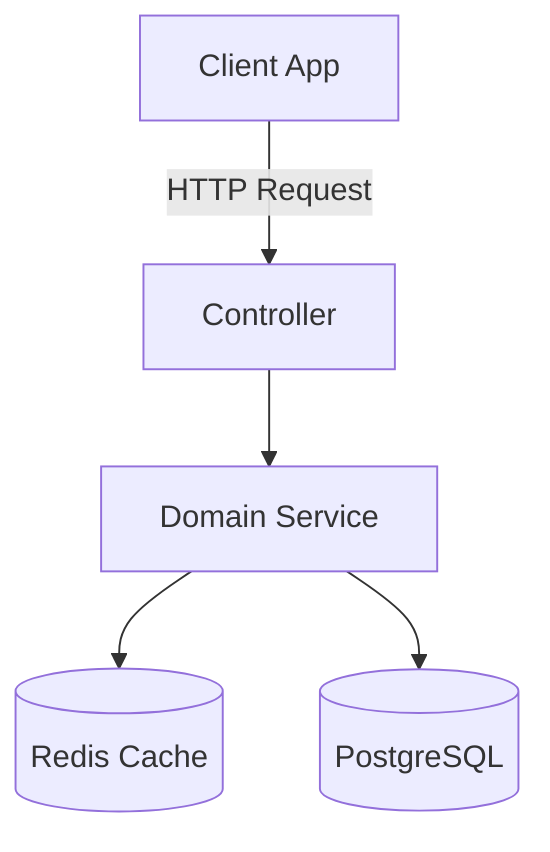
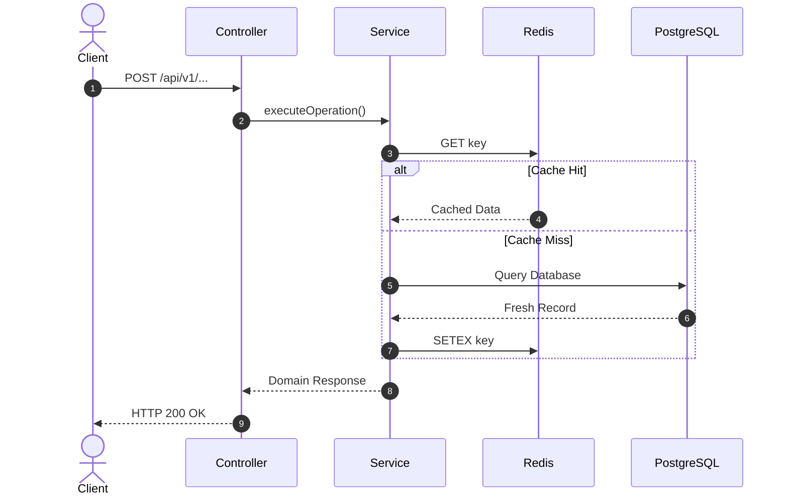
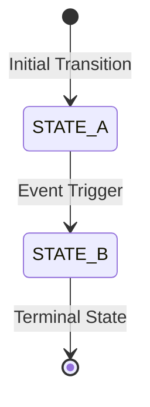
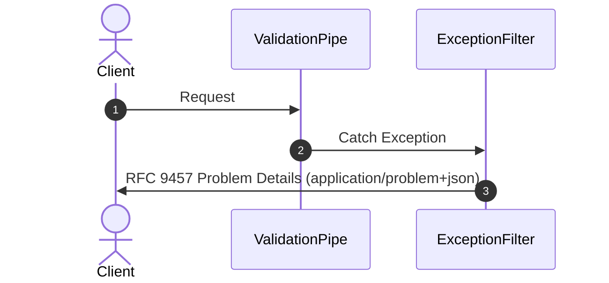

# SSOT Workflow Documentation Standard

Canonical location: `docs/design/<kebab-case>-workflow.md`

## 1. Document Archetypes

Defined by frontmatter `docType`:

| `docType`                 | Scope                                             | Core Requirements                                                                                                                       |
| :------------------------ | :------------------------------------------------ | :-------------------------------------------------------------------------------------------------------------------------------------- |
| `feature-workflow`        | Business features (Auth, Payment, Booking).       | Runtime Context Flowchart, Autonumbered Mermaid Sequence Diagram, State Transitions, Domain Invariants (INV-N), Security & Reliability. |
| `infrastructure-workflow` | Cross-cutting tech (Guards, Filters, Middleware). | Exception/Middleware Sequence Flow, Bootstrap Blueprint, Data Leak Audit, Defense-in-Depth Safeguards.                                  |

---

## 2. Core Architectural Principles (arc42 Runtime View)

In alignment with **arc42 Section 6 (Runtime View)** and **Diagrams-as-Code** best practices:

1. **Mandatory Runtime Sequence Diagram**:
   - Every workflow document MUST contain an autonumbered Mermaid sequence diagram (`sequenceDiagram autonumber`) tracing request flow across actors, controllers, guards, services, caches, queues, and databases.
   - All branch points (`alt / else`), error fallbacks, and retry sagas must be clearly illustrated.
2. **Explicit Domain Invariants (`INV-N`)**:
   - Every business workflow MUST define a formal Invariant Taxonomy (`INV-1..N`) with mathematical/logical conditions and verification test strategies.
3. **Symbol Referencing over Code Duplication**:
   - **Strict Prohibition**: Never copy-paste raw TypeScript type declarations, SQL DDL schemas, or lengthy JSON payloads into Markdown documentation (per `docs/standards/domain-docs.md`).
   - Reference code symbols directly by path (e.g. `ShowSeatsResponseDto` in `src/modules/shows/dto/show-seats-response.dto.ts`). OpenAPI/Swagger is the authoritative API contract.
4. **No Project Management Artifacts**:
   - Work breakdown structures (WBS), task lists, and sprint schedules belong in GitHub Issues or project management boards. Never commit static task tables into git documentation.

---

## 3. Feature Workflow Template (`docType: feature-workflow`)

````md
---
title: "<Feature Name> Workflow & Architecture Spec"
docType: feature-workflow
status: approved
date: YYYY-MM-DD
author: "Team / Core Architecture"
version: "1.0.0"
---

# <Feature Name> SSOT Workflow

---

## Overview & Context

- **Problem Statement**: What business problem does this solve?
- **Core Decisions**: Summary of key architectural choices and trade-offs.

---

## Architecture & Dataflow

### System Context



### Sequence Diagram



### State Machine (If Applicable)



---

## Security & Reliability

1. **Access Control & Rate Limiting**: Authentication guards and throttling tier.
2. **Graceful Degradation / Fail-Open**: Behavior during cache or network outages.
3. **Data Sanitization**: PII masking and structured logging rules.

---

## Domain Invariant Taxonomy (INV-N)

| Invariant ID | Domain Invariant Name | Formal Condition         | Verification Test Strategy        |
| :----------- | :-------------------- | :----------------------- | :-------------------------------- |
| **INV-1**    | Rule Name             | Formal logical predicate | Dedicated test case in `test/...` |
| **INV-2**    | Fallback Rule         | Error recovery condition | Integration failure test          |
````

---

## 4. Infrastructure Workflow Template (`docType: infrastructure-workflow`)

````md
---
title: "<Component Name> Infrastructure Workflow"
docType: infrastructure-workflow
status: approved
date: YYYY-MM-DD
---

# Infrastructure Guide: <Component Name>

## 1. Sequence Diagram



## 2. Security Safeguards

- Omit stack traces in production.
- Sanitize raw database exceptions before emitting client responses.
- Attach structured event IDs for Sentry correlation.
````
