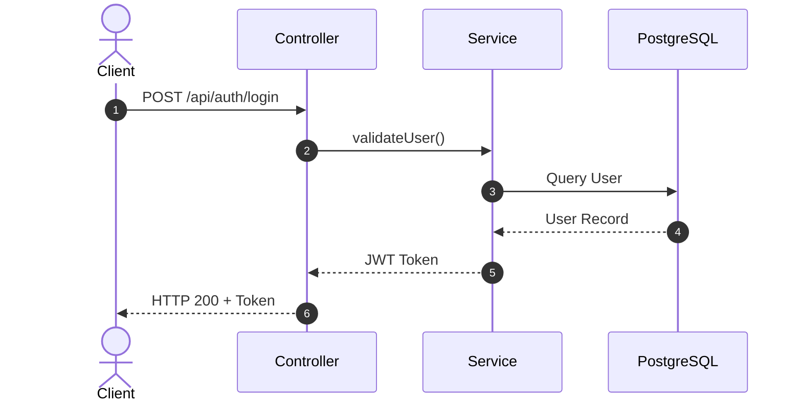

# SSOT Workflow Documentation Standard

Canonical location: `docs/design/<kebab-case>-workflow.md`

## 1. Document Archetypes

Defined by frontmatter `docType`:

| `docType`                 | Scope                                             | Core Requirements                                                                                    |
| :------------------------ | :------------------------------------------------ | :--------------------------------------------------------------------------------------------------- |
| `feature-workflow`        | Business features (Auth, Payment, Booking).       | Business logic, 4-Level WBS Table, Autonumbered Mermaid Sequence diagram, Defense-in-Depth security. |
| `infrastructure-workflow` | Cross-cutting tech (Guards, Filters, Middleware). | Exception/Middleware flow, Bootstrap blueprint, Production data leak audit checklist.                |

## 2. 4-Level WBS Table Standard

All workflow docs MUST use a Markdown WBS Table decomposing work into 4 levels (`1.0` ➔ `1.1` ➔ `1.1.1` ➔ `1.1.1.1`):

| WBS Code  | Component / Feature | Level             | Description / Task   | Output / Artifact       |
| :-------- | :------------------ | :---------------- | :------------------- | :---------------------- |
| **1.0**   | **[Module]**        | **L1: Module**    | Module boundary      | `src/modules/[module]`  |
| **1.1**   | **[Feature]**       | **L2: Component** | Detailed feature     | `[HTTP] /api/...`       |
| **1.1.1** | **[Guard/Logic]**   | **L3: Logic**     | DTO / Guard handling | `src/.../file.guard.ts` |
| 1.1.1.1   | Subtask             | L4: Execution     | Logic / Exception    | `src/...`               |

## 3. Feature Workflow Template (`docType: feature-workflow`)

````md
---
title: Auth Workflow & Architecture Spec
docType: feature-workflow
status: draft
date: 2026-08-19
---

# Feature Spec: Auth Workflow

## 1. Work Breakdown Structure (WBS)

| WBS Code | Component       | Description  | Output / Artifact      |
| :------- | :-------------- | :----------- | :--------------------- |
| **1.0**  | **Auth Module** | Core auth    | `src/modules/auth`     |
| **1.1**  | **Login**       | Handle login | `POST /api/auth/login` |

## 2. Sequence Diagram


````

## 3. Security & Defense-in-Depth

- Layer 1: Rate Limiter Guard
- Layer 2: Password hashing & token revocation

## 4. Implementation Checklist

- [ ] Step 1: DTO Validation
- [ ] Step 2: Service Logic
- [ ] Step 3: Tests

````

## 4. Infrastructure Workflow Template (`docType: infrastructure-workflow`)

```md
---
title: GlobalExceptionFilter Workflow Audit Guide
docType: infrastructure-workflow
status: approved
date: 2026-08-19
---

# Infrastructure Guide: GlobalExceptionFilter

## 1. Sequence Diagram

```mermaid
sequenceDiagram
    autonumber
    actor Client
    participant Pipe as ValidationPipe
    participant Handler as ExceptionFilter
    Client->>Pipe: Request
    Pipe->>Handler: Catch Exception
    Handler->>Client: Formatted JSON (application/problem+json)
````

## 2. Security Safeguards

- Omit stack traces in production.
- Shield raw DB query exceptions.

```

```
